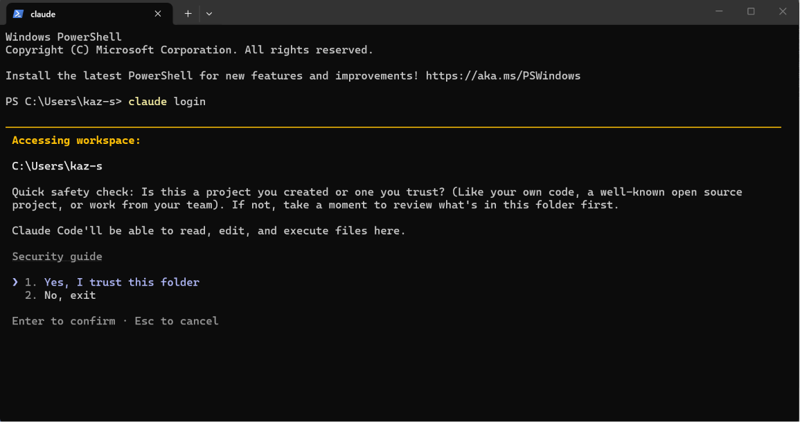
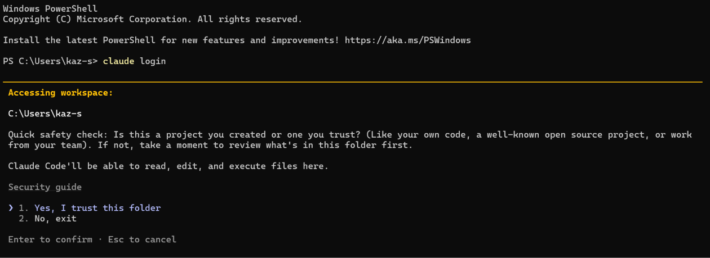
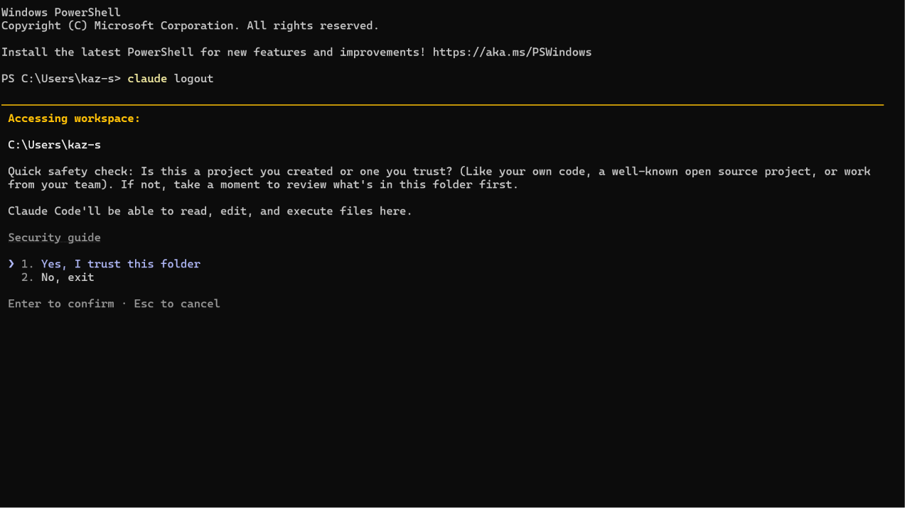
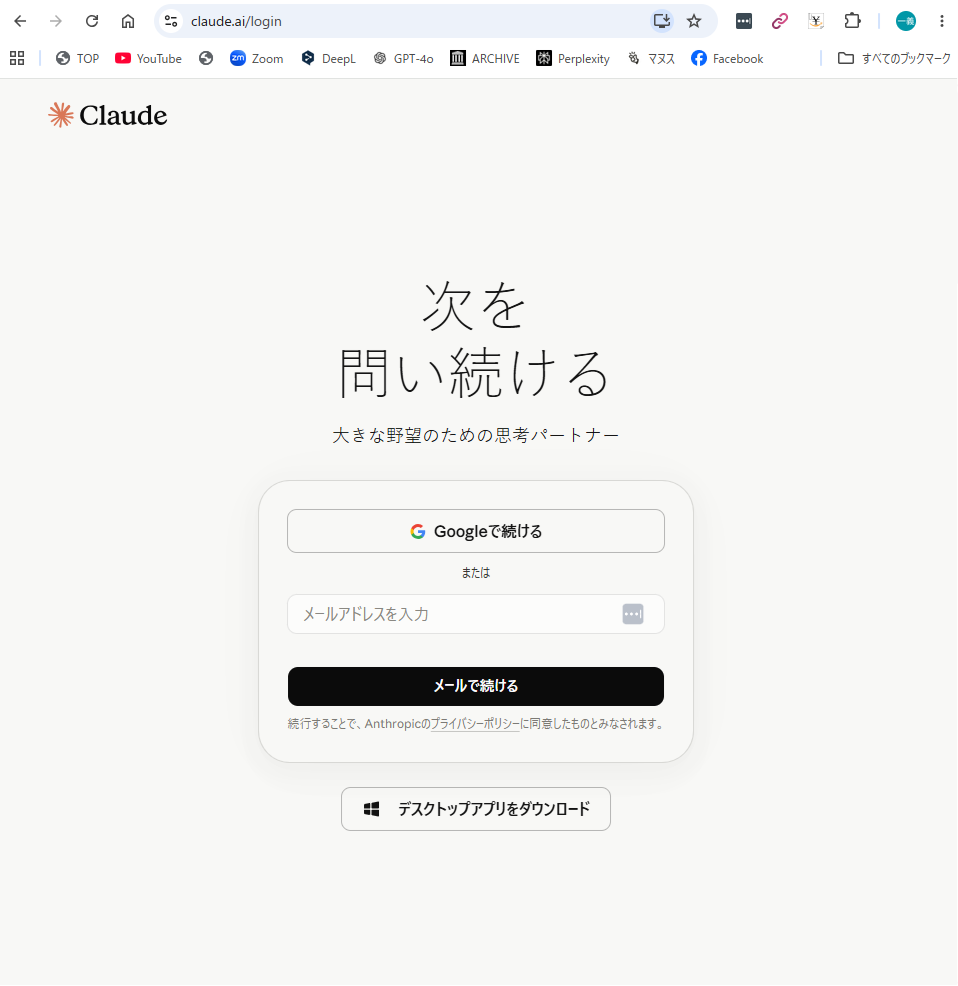
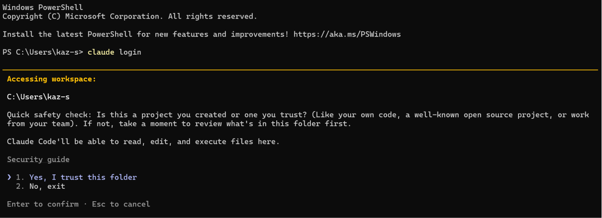
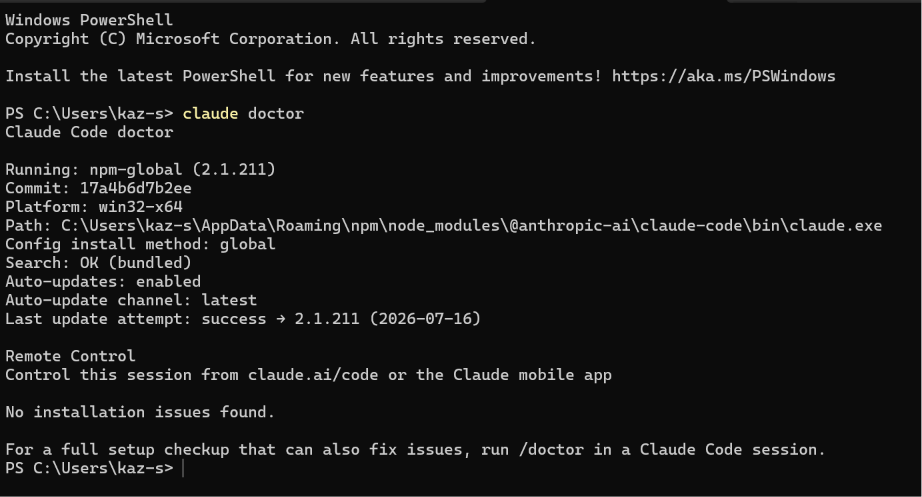

# Claude Code ログインガイド

## はじめに

このガイドでは、Windows 11でClaude Codeを利用するためのログイン方法を説明します。

MulmoClaudeではClaude Codeを利用するため、最初に認証を行います。

---

## Claude Codeとは

Claude CodeはAnthropicが提供するAIコーディングツールです。

一度ログインすると、VS CodeやPowerShellから利用できます。

---

## ログイン手順

### 1. PowerShellを開く

Windows TerminalまたはPowerShellを起動します。



---

### 2. Claude Codeを起動する

PowerShellで次のコマンドを入力し、Enterキーを押します。

```powershell
claude login
```



---

### 3. フォルダーを信頼する

「Yes, I trust this folder」を選択します。



---

### 4. Claudeへログイン

登録済みのメールアドレスでログインします。

Googleアカウントでもログインできます。


---

### 5. 認証を許可する

認証確認画面が表示された場合は、**「Authorize」** をクリックします。

すでに認証済みの環境では、この画面が表示されず、そのままログインが完了する場合があります。

ログインが完了すると、自動的に PowerShell に戻り、Claude Code が利用できるようになります。

---

## この章の確認

次の画面が表示されれば成功です。

- Welcome back
- Claude Pro
- Sonnet 4.6



続いて、PowerShellで次のコマンドを実行します。

問題なく動作すればセットアップ完了です。


