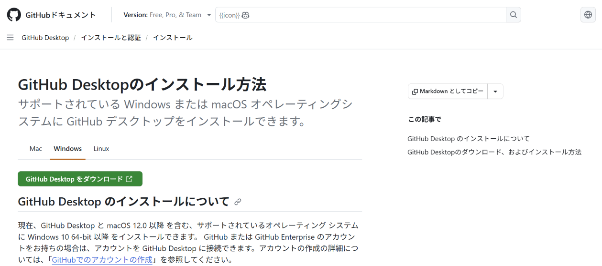
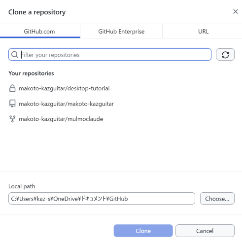
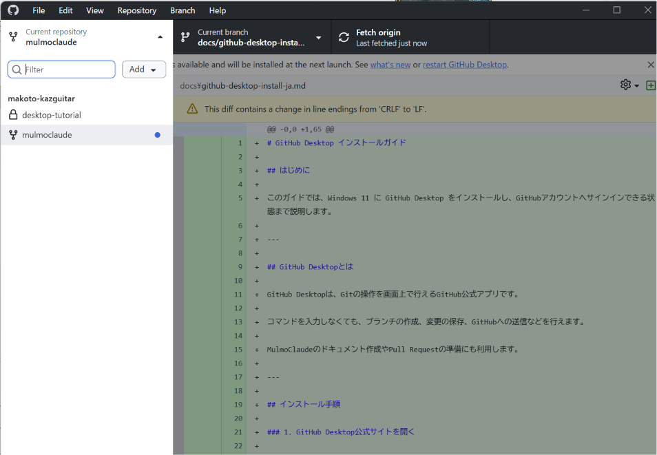

# GitHub Desktop インストールガイド

## はじめに

このガイドでは、Windows 11 に GitHub Desktop をインストールし、GitHubアカウントへサインインできる状態まで説明します。

---

## GitHub Desktopとは

GitHub Desktopは、Gitの操作を画面上で行えるGitHub公式アプリです。

コマンドを入力しなくても、ブランチの作成、変更の保存、GitHubへの送信などを行えます。

MulmoClaudeのドキュメント作成やPull Requestの準備にも利用します。

---

## インストール手順

### 1. GitHub Desktop公式サイトを開く

ブラウザーで次のページを開きます。

<https://desktop.github.com/>

### 2. GitHub Desktop をダウンロード

「Download for Windows」をクリックします。

### 3. インストーラーを実行

ダウンロードしたインストーラーを起動します。

基本的には、そのまま待つだけでインストールが完了します。

### 4. GitHubへサインイン

GitHub Desktopが起動したら、「Sign in to GitHub」をクリックします。

ブラウザーが開きますので、GitHubアカウントでログインしてください。

### 5. リポジトリをクローンする

「Clone a Repository」をクリックします。

## この章の確認

GitHub Desktopが起動し、次のどちらかが表示されれば準備完了です。

- Current Repository
- Clone Repository

のどちらかが表示されれば準備完了です。

